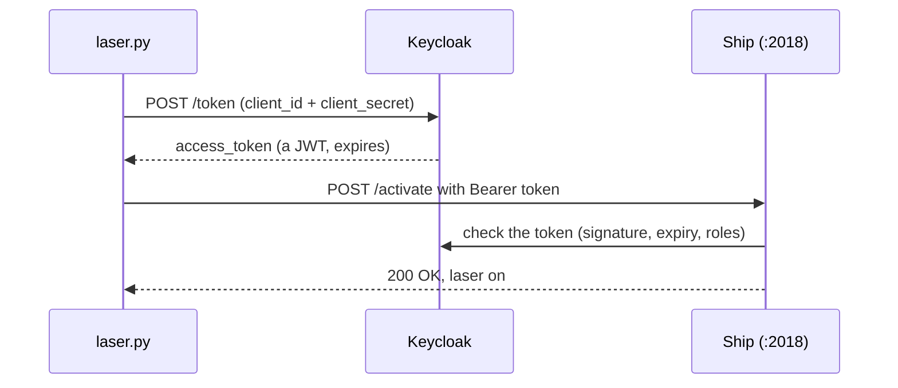
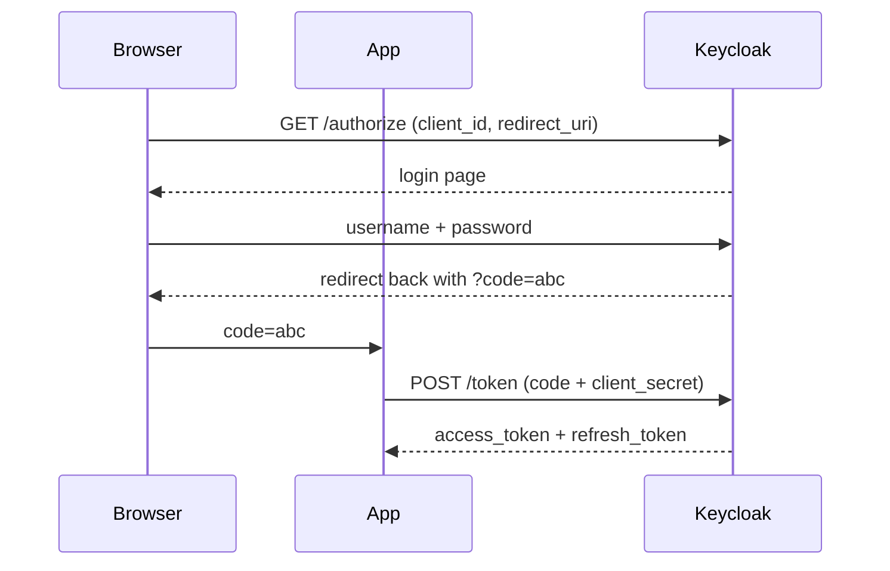

# OAuth2 and Keycloak

> **Status: preparation.** This is the next task in [[M321 - The Ship]]
> (`laser.py`). Not built yet. This page is what you need to know before
> you start. Back to [[Python MOC]]

## The problem OAuth2 solves

The naive approach is to give the laser a password. Three problems:

- The password sits in your code or your config file.
- Whoever has it can do **everything**, not just fire the laser.
- To take access away you have to change the password, and then every
  other program that used it breaks too.

OAuth2 flips it around. You get a **token**: it only allows certain
things, it expires after a short time, and you can cancel it on its own.
Your program never sees the actual password.

Memory aid: **authentication** is "who are you", **authorisation** is
"what are you allowed to do". OAuth2 is really about the second one.
OpenID Connect (OIDC) is the layer on top that also tells you who the user
is.

## What Keycloak is

A ready made authorisation server from Red Hat. Instead of building your
own token system, you stand Keycloak up and let it do that job. It speaks
OAuth2, OIDC and SAML, has an admin web interface, and runs as a Docker
image.

Four words you need:

| Word | What it is |
|---|---|
| **Realm** | A sealed off area with its own users, its own clients, its own keys. For school, one realm is enough. |
| **Client** | An application allowed to ask for tokens. Your laser script is a client. It has a `client_id` and usually a `client_secret`. |
| **User** | A human with a username and password. |
| **Role** / **Scope** | What the token is allowed to do. Ends up written inside the token. |

## The two flows that matter

### Client credentials: machine talks to machine

No human involved. Exactly what a script like `laser.py` needs.



The whole dance is **one extra HTTP call** compared to what you do now.
That is genuinely all it is.

### Authorization code: a human logs in

The one with the browser redirect. This is why `configure_oauth()` wants an
`authorize_url` as well as a `token_url`.



Why the detour through a code? So the token never travels through the
browser address bar, where it would end up in logs and browser history.
Modern clients add **PKCE** on top, which makes a stolen code useless on
its own.

## What is inside a token

An access token is usually a **JWT**: three chunks of base64 separated by
dots.

```
header.payload.signature
```

```json
{
  "exp": 1789000000,
  "iss": "http://keycloak:8080/realms/the-ship",
  "azp": "laser-client",
  "realm_access": { "roles": ["laser-operator"] }
}
```

The payload is **not encrypted**, only signed. Anyone can read it. So never
put secrets inside a token. The signature only stops people from forging
one.

Three kinds of token:

- **Access token**: the badge you show. Short lived, often 5 minutes.
- **Refresh token**: used to get new access tokens without logging in
  again. Long lived, so guard it well.
- **ID token**: OIDC only, says **who** the user is. Irrelevant for pure
  machine to machine.

## For your task specifically

What the code sends today:

```python
"authorize_url": f"http://{oauth_host}:2015/authorize",
"token_url":     f"http://{oauth_host}:2015/token",
```

**Keycloak names its endpoints differently.** Real Keycloak URLs look like
this:

```
http://<host>:<port>/realms/<realm>/protocol/openid-connect/auth
http://<host>:<port>/realms/<realm>/protocol/openid-connect/token
```

So either you change the URLs in `laser_commands.py`, or there is a proxy
in front that forwards `/authorize` and `/token`. Finding out which is the
first step. Not writing code.

Your checklist:

- [ ] Start Keycloak. Docker is enough:
      `docker run -p 8080:8080 -e KC_BOOTSTRAP_ADMIN_USERNAME=admin -e KC_BOOTSTRAP_ADMIN_PASSWORD=admin quay.io/keycloak/keycloak:26.0 start-dev`
- [ ] **Sort out the port.** RabbitMQ management already uses NodePort
      2015. If Keycloak wants the same number, they clash.
- [ ] Create a realm, create a client, set the client type to
      *confidential* so it gets a `client_secret` at all.
- [ ] Put the `client_secret` in `local_config.py`. Not in the code, not in
      git. Your `.gitignore` already covers it.
- [ ] Put the real Keycloak URLs into `laser_commands.py`.
- [ ] Get a token with `curl` **first**, then write Python. If curl cannot
      get a token, Python will not either, and you would be hunting the bug
      in the wrong layer.

Testing a token by hand:

```bash
curl -X POST "http://localhost:8080/realms/the-ship/protocol/openid-connect/token" \
  -d "grant_type=client_credentials" \
  -d "client_id=laser-client" \
  -d "client_secret=YOUR_SECRET"
```

## When it does not work

| Symptom | Usually means |
|---|---|
| **401 Unauthorized** | No token sent, or wrongly formatted. The header must read `Authorization: Bearer <token>`. |
| **403 Forbidden** | Token is valid but the role is missing. Check the client's permissions. |
| **400 invalid_client** | Wrong `client_id` or `client_secret`, or the client is *public* instead of *confidential*. |
| **Token expired instantly** | Clock difference between container and host. `exp` is checked to the second. |
| **invalid_redirect_uri** | Authorization code flow only: the `redirect_uri` must be registered on the client exactly. |

Note the pattern: **401 means "I do not know you", 403 means "I know you
and the answer is no"**. Same distinction as the RabbitMQ 403 in
[[RabbitMQ Setup and the guest User]].

## The Python side

For client credentials you need no library, `requests` is enough:

```python
def get_token():
    response = requests.post(
        TOKEN_URL,
        data={
            "grant_type": "client_credentials",
            "client_id": CLIENT_ID,
            "client_secret": CLIENT_SECRET,
        },
        timeout=10,
    )
    response.raise_for_status()
    return response.json()["access_token"]
```

Note `data=` and not `json=`. The token endpoint wants
`application/x-www-form-urlencoded`, not JSON. That is the mistake
everybody makes exactly once.

And because tokens expire: either fetch a fresh one before every call
(completely fine for a school task) or cache it and only refresh when you
get a 401. A decorator would be elegant for that, see
[[Closures and Decorators]].


